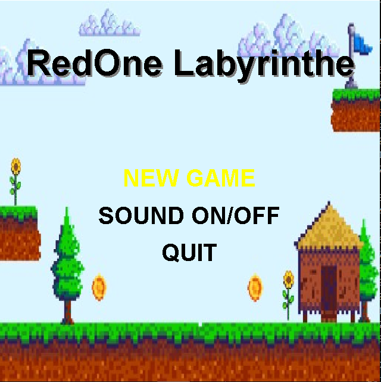
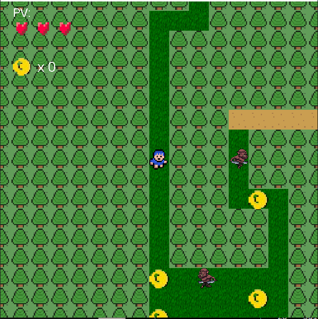
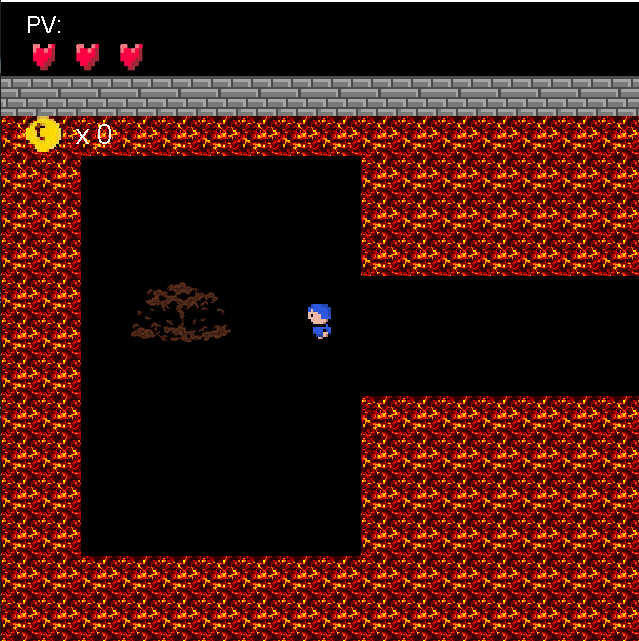
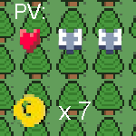

#  Balade dans un Labyrinthe - Sprint 03 

Ce projet est un jeu d'aventure 2D développé en Java où le joueur incarne un héros explorant un labyrinthe tout en évitant des monstres intelligents.

##  Déroulement du Jeu

Incarnez un héros et explorez un labyrinthe mystérieux divisé en 2 niveaux progressifs. Le but est de naviguer à travers les chemins (herbe/terre) avec les touches WASD ou fléchées, tout en évitant les obstacles (eau/murs/arbres). Collectez des pièces (coins jaunes) et la clé (tile bleu) pour progresser.

- Niveau 1 : Collectez au moins 10 pièces + clé pour passer au niveau 2.
- Niveau 2 : Atteignez le trésor final pour gagner.
- Attaques : Appuyez sur ESPACE près d'un monstre (3 fois max par swing) pour l'attaquer et le tuer.
- Monstres : Ils errent aléatoirement ou vous chassent (IA basique). Collision = -1 PV (3 max, HUD cœurs).
- Fin : 0 PV = Game Over (overlay rouge, auto-retour menu après 3s). Victoire = "YOU WON!" (overlay jaune).
- Menu : NEW GAME (reset complet), SOUND ON/OFF (toggle sons), QUIT. 
- Sons pour mouvement, hit, win/lose.
 
---
## Captures d'écran

**Menu Principal**


**Gameplay Niveau 1**


**Gameplay Niveau 2**


**HUD (Head-Up-Display):** Points de vie (rouge plein/gris vide) et score selon le nombre de pièces collectés




##  Installation et Lancement

Suivez ces étapes pour compiler et jouer au jeu sur votre machine locale.

### Prérequis

* **Git**
* **Java (JDK) :** OpenJDK 25
* **Maven**

### Étapes d'Installation

**1. Créer un dossier de travail**
Ouvrez votre terminal, créez un dossier pour le projet (par exemple, `MesJeux`) et entrez-y.

```bash
mkdir MesJeux
cd MesJeux
```
## 2. Cloner le dépôt Téléchargez le code source depuis GitHub.

```Bash
git clone https://github.com/Radhwen-HAJRI/ACL.git
```
## 3. Accéder au dossier du projet Une fois le clonage terminé, déplacez-vous dans le dossier du projet.

```Bash
cd ACL
```

## 4. Compiler le projet (Packaging) Utilisez Maven pour créer le fichier .jar exécutable.

```Bash

mvn clean package
```

## 5. Lancer le jeu ! Exécutez le jeu avec la commande suivante :

```Bash
java -cp target/labyrinthe-1.0-SNAPSHOT.jar main.main
```

## Informations Techniques
Langage : Java

Version du JDK : OpenJDK 25

Outils : Maven (build), Swing (rendu), Java Sound API (sons).
Structure :

* Packages :main (GamePanel, KeyHandler, SoundManager), entity (Player, Monster), tile (TileManager, Labyrinthe).
* Ressources :/resources/tiles/ (images), /sounds/ (WAV), /maps/ (map01.txt, map02.txt).
* Fonctionnalités clés : Caméra follow, collisions solides, IA monstres (chase/attack), HUD dynamique, menu toggle son, reset multi-niveaux.